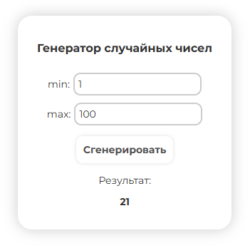

<h1 align="center">Генератор случайных чисел на JS</h1>

<h2 align="left">Описание проекта</h2>

Проект представляет собой веб-приложение, которое генерирует случайные числа в указанном диапазоне, подобно популярному сервису random.org. Это полезный инструмент для различных задач, таких как случайный выбор победителей, генерация случайных чисел для игр или тестирования.

Цель проекта — улучшение навыков работы с JavaScript, а также освоение взаимодействия с DOM и манипуляций с пользовательским вводом.

Просмотреть проект можно на GitHub Pages по ссылке:
https://cicada0909.github.io/RandomNumberGenerator/

Цель создания проекта:
Закрепление навыков работы с JavaScript, создание интерактивного веб-приложения с использованием HTML, CSS и JavaScript.

<h2 align="left">Основные функции проекта</h2>

1. Пользователь вводит минимальное и максимальное значения для генерации случайного числа.
2. После нажатия на кнопку генерации появляется случайное число в пределах указанного диапазона.
3. Для визуализации процесса используется анимация загрузки (loader), чтобы создать эффект ожидания.
4. Валидация ввода: если введенные значения некорректны, пользователю отображается сообщение с просьбой ввести правильные данные.

<h2 align="left">Функциональность и использованные технологии</h2>

HTML и CSS: Структура страницы и внешний вид. Использованы адаптивные стили для корректного отображения на мобильных устройствах.

JavaScript: Логика генерации случайных чисел. Использованы функции для получения значений, проверки корректности ввода и отображения результата. Реализована анимация загрузки с помощью setTimeout.

<h2 align="left">Основные особенности</h2>

- Пользователь может выбрать диапазон для генерации случайного числа.
- Валидация ввода для обеспечения корректности значений.
- Анимация загрузки, которая скрывает результат до генерации числа.
- Простая и понятная визуализация, интуитивно понятный интерфейс.

<h2 align="left">Планы по доработке проекта</h2>

1. Добавить возможность сохранять историю сгенерированных чисел.
2. Добавить кнопку для копирования сгенерированного числа в буфер обмена.
3. Улучшить внешний вид с помощью анимаций и дополнительных стилей.

